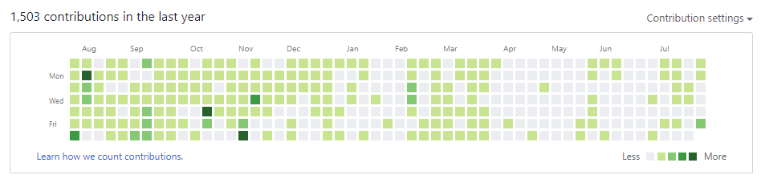
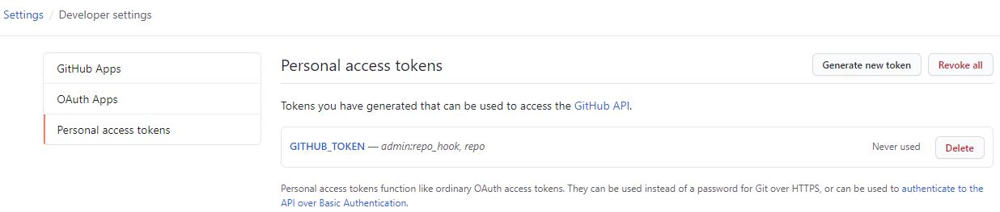

# crop-circles

> Github 麦田圈

------

## 运行环境

## 脚本介绍

用一年时间在 Github Profile 画一幅像素画（[查看进度](https://lyy289065406.github.io/crop-circles/)）：

## 实现原理

Github Profile 有一片 “草地” ，每天会从上到下、从左到右滚动更新。

其中每一列从周日开始，每一格的颜色根据当天的提交次数呈现不同的绿色深度：

- 0 次 ： 灰色
- &lt; 16 次 ： 浅绿
- &lt; 32 次 ： 翠绿
- &lt; 64 次 ： 深绿
- &gt;= 64 次 ： 墨绿

利用这个特征，通过 [Crontab](https://github.com/lyy289065406/cron-expression) 或 [Actions](https://docs.github.com/cn/actions/configuring-and-managing-workflows/configuring-a-workflow) 控制每天的提交次数，就可以实现全自动绘制麦田圈。

## 开发者部署

<b>无服务器方式（推荐）</b>

 

本项目已配置 [Github Actions](https://docs.github.com/cn/actions/configuring-and-managing-workflows/configuring-a-workflow)，因此你只需轻松几步即可实现部署：

- [Fork 本项目](https://github.com/lyy289065406/crop-circles) 到你的代码仓库
- 通过 Settings --> Secrets 配置环境变量：
 　　`LOGO`： 期望绘制到 Github Profile 的字符串，如 `EXP-REPO`
- 创建 [GITHUB_TOKEN](https://github.com/settings/tokens) 用于 [Github Actions](https://docs.github.com/cn/actions/configuring-and-managing-workflows/configuring-a-workflow) 提交变更（需要的最小权限 `admin:repo_hook, repo`）
- 启用 Settings --> Actions 功能

> 程序默认每 20 分钟执行一次（若要调整执行频率，可修改 [`autorun.yml`](.github/workflows/autorun.yml) 的 `schedule` 触发时点）

> `GITHUB_TOKEN` 是所有仓库通用的环境变量，只需生成一次，详细可参看 [官方教程](https://docs.github.com/en/github/authenticating-to-github/creating-a-personal-access-token)

<b>有服务器方式</b>

 

- 任意找一台 Linux 服务器（阿里云、腾讯云等）
- 安装 python 2.7
- 安装 GitPython 模块： `sudo pip install GitPython`
- 安装 git 客户端
- 在 Github Fork 这个仓库： [https://github.com/lyy289065406/crop-circles](https://github.com/lyy289065406/crop-circles)
- 把仓库 checkout 到服务器本地： `git clone https://github.com/{{your_repo}}/crop-circles`
- checkout 的位置任意即可，如： `/tmp/crop-circles`
- 设置使用 SSH 与 Github 连接（避免提交内容时要输入账密），详见 [这里](https://help.github.com/en/articles/connecting-to-github-with-ssh)
- 若设置 SSH 后还要输入密码才能提交，则还需要把仓库的 https 协议改成 ssh，详见 [这里](https://help.github.com/en/articles/changing-a-remotes-url#switching-remote-urls-from-https-to-ssh)
- 修改 crontab 配置文件，设置定时任务： `crontab -e`
- 设置定时任务命令（每小时）： `0 * * * * python /tmp/crop-circles/main.py -logo "YOUR-LOGO"`
- 注意脚本位置需使用绝对路径，根据实际 checkout 的位置修改即可
- 保存 crontab 配置文件后会自动生效，查看日志： `tail -10f /var/log/cron`

## LOGO 限制

- 支持的字符范围： 大写字母 `A-Z`， 数字 `0-9`， 以及部分英文符号
- LOGO 宽度： 总宽度 `<=` 53

其中：

- 字母宽度： 固定值 7
- 数字宽度： 固定值 7
- 符号宽度： 固定值 3

> 查看支持字符的命令： `python main.py -v`

<b>支持绘制的字符清单</b>

 

| character | width | character | width |
|:----:|:----:|:----:|:----:|
| `A` | `7` | `B` | `7` |
| `C` | `7` | `D` | `7` |
| `E` | `7` | `F` | `7` |
| `G` | `7` | `H` | `7` |
| `I` | `7` | `J` | `7` |
| `K` | `7` | `L` | `7` |
| `M` | `7` | `N` | `7` |
| `O` | `7` | `P` | `7` |
| `Q` | `7` | `R` | `7` |
| `S` | `7` | `T` | `7` |
| `U` | `7` | `V` | `7` |
| `W` | `7` | `X` | `7` |
| `Y` | `7` | `Z` | `7` |
| `0` | `7` | `1` | `7` |
| `2` | `7` | `3` | `7` |
| `4` | `7` | `5` | `7` |
| `6` | `7` | `7` | `7` |
| `8` | `7` | `9` | `7` |
| `(` | `3` | `)` | `3` |
| `[` | `3` | `]` | `3` |
| `{` | `3` | `}` | `3` |
| `<` | `3` | `>` | `3` |
| `·` | `3` | `.` | `3` |
| ` ` | `3` | `,` | `3` |
| `;` | `3` | `:` | `3` |
| `?` | `3` | `!` | `3` |
| `$` | `3` | `^` | `3` |
| `*` | `3` | `=` | `3` |
| `+` | `3` | `-` | `3` |
| `_` | `3` | `|` | `3` |
| `\` | `3` | `/` | `3` |
| `'` | `3` |   |   |

## 版权声明

　[-EXP%202016-blue.svg)](http://exp-blog.com)　

- Site: [http://exp-blog.com](http://exp-blog.com) 
- Mail: <a href="mailto:289065406@qq.com?subject=[EXP's Github]%20Your%20Question%20（请写下您的疑问）&amp;body=What%20can%20I%20help%20you?%20（需要我提供什么帮助吗？）">289065406@qq.com</a>

------
